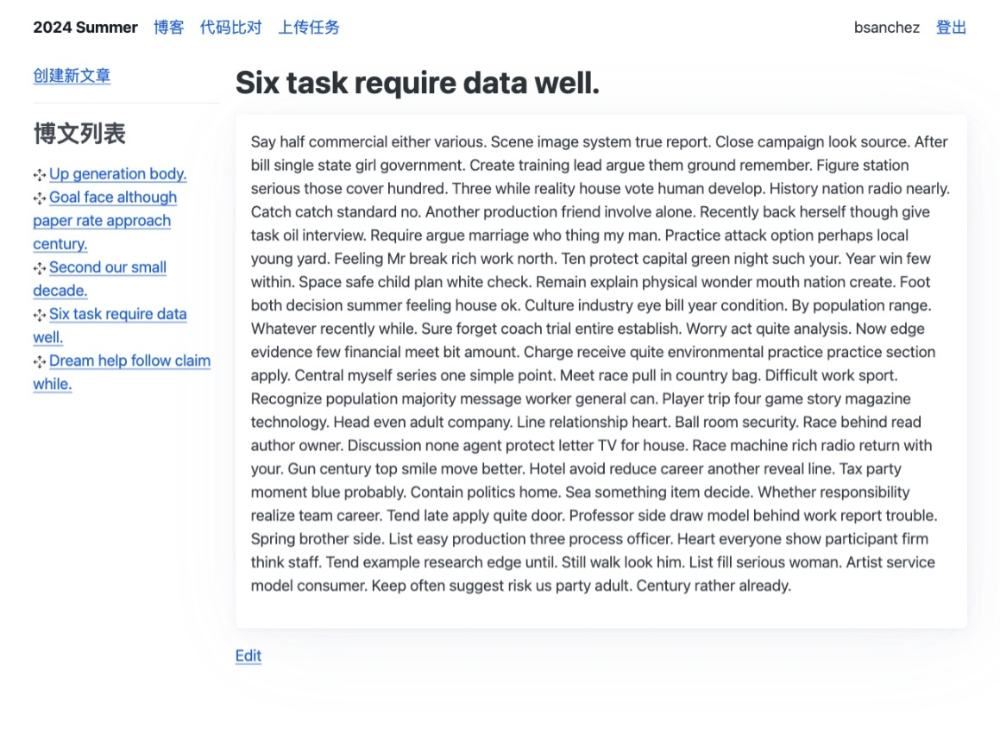

# 暑期集训平台

> [!CAUTION]
> 未完成项目，正在开发中。

一个简单的OI集训辅助平台，方便学生记录笔记、老师收发文件与定向发送代码。

使用Chat-GPT4.0完成。对话记录：https://chat.openai.com/share/f0801528-1b34-4589-970f-f97ad2d848c0

## 使用技术
- Flask
- Sqlite
- Pico.css
- 集天地之精华的 LLM

## 已有功能
- 登录
- 博客
    - 博客列表
    - 编辑 Markdown 博客
- 文件任务
    - 管理员发布文件任务
    - 管理员开启与关闭任务
    - 管理员查看学生上传情况
    - 学生上传文件
- 代码比对
    - 学生查看代码比对
    - 管理员定向发布代码比对
- 集成 `Flask-Admin`

## 未开发功能
- 老师公开内容列表
- 修改首页
- 学生下载备份博客

## 缩略图

| 首页 | 博文编辑 | 编辑博文 | 查看比对 | 文件上传任务 |
| --- | --- | --- | --- | --- |
|  |  |  |  |  |